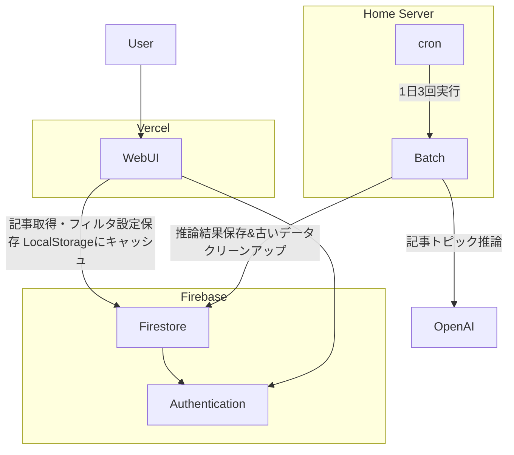

# フィルタリングが強いニュースサイト
LLMで遊ぶネタとして、トピックなどを推論してもらってそれ使ってフィルタリングするサイトを作る。

https://clean-news-pied.vercel.app/login


## ツール
- firebase CLI
- gcloud CLI

## firebase setup

```
firebase login
gcloud init
```

## セキュリティルール適用

```
firebase deploy --only firestore:rules
```

## 構成


